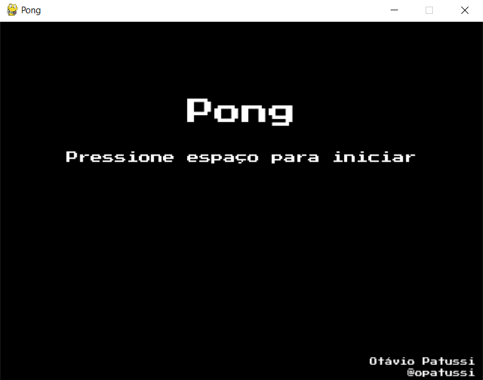

# PONG Game em Python

Bem-vindo ao README do jogo PONG em Python! Este documento fornece uma visão geral do jogo PONG, descreve as funcionalidades e explica como executar o código.

## Visão Geral
O PONG é um jogo clássico de arcade que simula um jogo de tênis de mesa. Dois jogadores controlam as paletas no lado esquerdo e direito da tela, e seu objetivo é rebater a bola para o lado oposto, marcando pontos quando o oponente não consegue rebatê-la.

Este código em Python implementa uma versão simples do jogo PONG. Ele usa a biblioteca `pygame` para lidar com a renderização gráfica e a detecção de colisões.

## Funcionalidades
- Dois jogadores podem jogar, controlando as paletas usando as teclas de seta para cima e para baixo para o jogador 1 e para o jogador 2, `W` e `S`.
- A bola se move de forma realista e rebate nas paletas e nas paredes superior e inferior.
- O jogo acompanha a pontuação de ambos os jogadores.
- O jogo termina quando um dos jogadores atinge uma pontuação máxima definida.

## Requisitos do Sistema
Certifique-se de ter o seguinte software instalado em seu sistema antes de executar o código:
- Python 3.x: [Download Python](https://www.python.org/downloads/)
- Pygame: Execute o seguinte comando no terminal para instalar o Pygame:
pip install pygame

## Executando o Jogo
Para executar o jogo PONG, siga as etapas abaixo:
1. Baixe ou clone o repositório do código para o seu computador.
2. Navegue até o diretório onde você salvou o código.
3. Abra um terminal ou prompt de comando nesse diretório.
4. Execute o seguinte comando:
python pong.py
5. O jogo será iniciado e exibirá a tela do PONG.
6. Use as teclas de seta para cima e para baixo para controlar as paletas dos jogadores.
7. O jogo continuará até que um dos jogadores alcance a pontuação máxima definida.
8. A cada ponto, a bola irá ficar mais rápida.

## Personalização
Você pode personalizar várias configurações do jogo no arquivo `pong.py`. Aqui estão algumas opções que você pode modificar:
- `SCREEN_WIDTH` e `SCREEN_HEIGHT`: definem a largura e a altura da tela do jogo.
- `PADDLE_WIDTH` e `PADDLE_HEIGHT`: definem a largura e a altura das paletas dos jogadores.
- `BALL_SIZE` e `BALL_SPEED`: definem o raio da bola e a velocidade de movimento.
- `MAX_SCORE`: define a pontuação máxima para encerrar o jogo.

Sinta-se à vontade para explorar o código e fazer ajustes de acordo com suas preferências.

### Observações:
O jogo possui som, porém estão desabilitados, para habilitar deve-se alterar os valores 'mixer.Sound' e 'mixer.music'
nas linhas 40 a 42, no arquivo pong.py.

## Recursos Adicionais
- [Documentação do Pygame](https://www.pygame.org/docs/): Aprenda mais sobre a biblioteca Pygame.
- [Tutorial de PONG em Python](https://www.101computing.net/pong-tutorial-using-pygame-getting-started/): Tutorial detalhado sobre como criar o jogo PONG em Python usando o Pygame.

Divirta-se jogando
